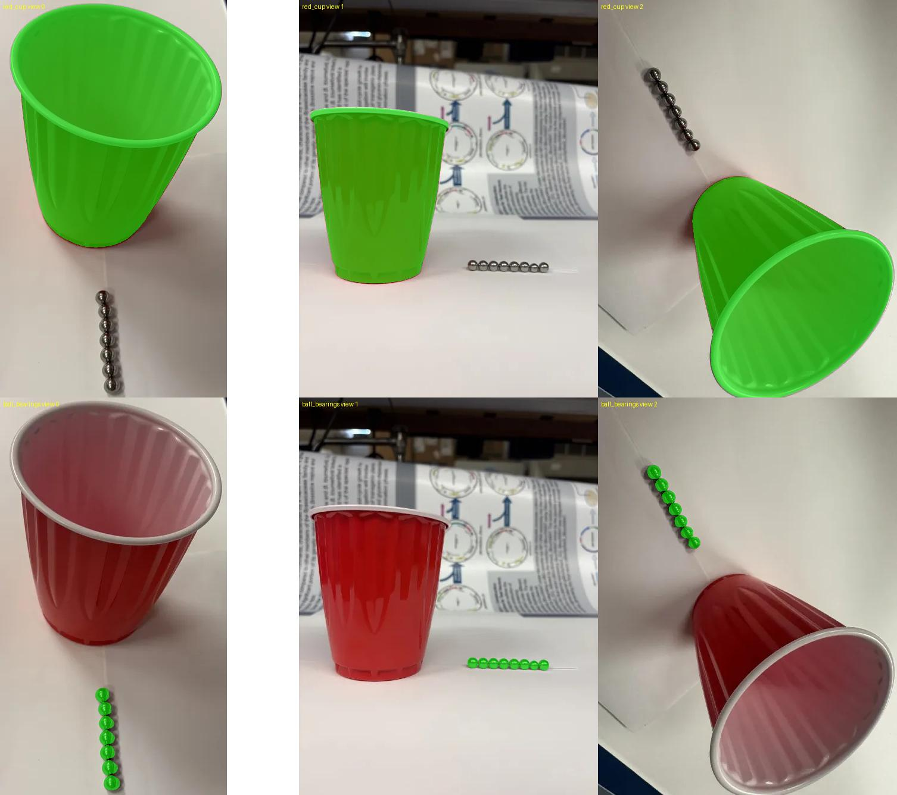
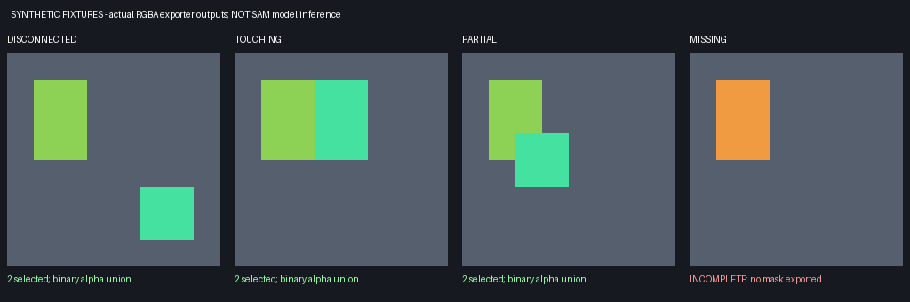

# Data Preparation

[Installation](Installation) · Next: [Running](Running)

> **Latest workflow:** the [SAM 3 text-only two-view run](SAM3-Two-View-Walkthrough) is now verified, using original views `0.png` and `2.png`, one cup, and seven visible bearings per image. Its [input bundle](assets/issue2-sam3-inputs.zip) is separate. The three-view inputs below belong to the earlier **SAM 1 box-prompted** experiment.

> **Photo requirements for measurements:** use the original camera files (JPG, not HEIC), all in the **same orientation and size**. `scripts/run_da3.py` refuses a mixed set because DA3 would crop every frame. Include a reference sphere at least 40–50 px wide in every photo (for example a 40 mm ping-pong ball). See [Metric-Scale](Metric-Scale).

## Download the validated images and masks

To reproduce the completed GPU experiment without creating masks again, download [issue2-inputs.zip](assets/issue2-inputs.zip) into the repository root.

```bash
sha256sum issue2-inputs.zip
# 371f9b9ad551d9e5f538f7bd2aa99af53e6dee18514391e6a18a8d360d438c69
unzip -n issue2-inputs.zip
```

The archive contains three original images, six RGBA masks, and a prompt-record JSON under `data/issue2_cup_bearings/`. Extraction does not overwrite existing files; keep unrelated inputs with the same names in a separate location. Run the **three views × two objects check** below before continuing to [Running](Running).

These masks were generated with **SAM 1 and manually specified boxes per image**, not SAM 3. Each bearing was segmented separately, then its mask was included in the union. The [validation script](assets/prepare_issue2_masks.py) requires `facebook/sam-vit-huge` in the local Hugging Face cache. Its coordinates are specific to these three images; it is not a general automatic multi-object segmenter.



The top row shows the cup; the bottom row shows the bearing group. The supplied prompts identify 7/8/7 bearings across the three views. Check occlusion and scene changes before treating these photographs as measurements of a single fixed scene.

## 1. Source photographs from issue #2

Source: [Daily report 09/15/2026 part 2 — issue #2](https://github.com/wyim-pgl/MV-SAM3D/issues/2).

The completed experiment used the **first three attachments**. Similar or duplicated images later in the issue were not added as separate views.

| `images/0.png`                                                                                                                                    | `images/1.png`                                                                                                                                | `images/2.png`                                                                                                                                                  |
| ------------------------------------------------------------------------------------------------------------------------------------------------- | --------------------------------------------------------------------------------------------------------------------------------------------- | --------------------------------------------------------------------------------------------------------------------------------------------------------------- |
|  |  |  |

Download the original GitHub attachments. These are **input photographs, not segmentation masks**.

```bash
mkdir -p data/issue2_cup_bearings/images
curl -fL 'https://github.com/user-attachments/assets/3fd8d409-20cd-4fe0-86e1-7bb0a52644cd' \
  -o data/issue2_cup_bearings/images/0.png
curl -fL 'https://github.com/user-attachments/assets/eb533ae9-0b53-4ee4-8d10-615c33bf209e' \
  -o data/issue2_cup_bearings/images/1.png
curl -fL 'https://github.com/user-attachments/assets/1c969f4f-123e-48af-877c-64e0ed800641' \
  -o data/issue2_cup_bearings/images/2.png
```

The downloaded resolutions are **381×668, 502×668, and 502×668**, respectively. Each mask must match its source image's dimensions and pixel alignment. Regenerate masks and rerun DA3 after changing, rotating, or cropping an image.

For new captures, keep the objects fixed relative to one another and move only the camera. The capture conditions and physical dimensions in issue #2 have not been verified. Small reflective bearings and limited viewpoints can reduce reconstruction quality.

### Two-view selection for the SAM 3 run

Use only original views `0.png` and `2.png`; exclude the eight-bearing view `1.png`. Keep this dataset separate from the completed experiment:

```bash
mkdir -p data/issue2_seven_bearings/images
cp -n data/issue2_cup_bearings/images/0.png data/issue2_seven_bearings/images/0.png
cp -n data/issue2_cup_bearings/images/2.png data/issue2_seven_bearings/images/2.png
```

The verified workflow uses text-prompted detection, duplicate removal, and explicit `--counts 1,7` to select **one cup and seven visible bearings in each image**. Merely adding “seven” to a text prompt does not enforce the count. Insufficient distinct detections cause failure rather than fabricated masks.

SAM 3 masks, two-view DA3, reconstruction, and pose optimization have completed. See the [step-by-step commands and results](SAM3-Two-View-Walkthrough). Do not reuse the three-view DA3 file for this dataset.

## 2. Required directory layout for the validated experiment

```text
data/issue2_cup_bearings/
├── images/                 # Shared input photographs
│   ├── 0.png
│   ├── 1.png
│   └── 2.png
├── red_cup/                # Cup-only RGBA masks
│   ├── 0.png
│   ├── 1.png
│   └── 2.png
└── ball_bearings/          # All visible bearings grouped into one mask
    ├── 0.png
    ├── 1.png
    └── 2.png
```

`--mask_prompt red_cup,ball_bearings` reads the two mask directories. Supplying these names does not generate masks.

## 3. Mask requirements

- Format: **RGBA PNG**
- RGB: retain the original image colors
- Alpha: `255` for the object, `0` for the background
- Filename: match the corresponding photograph
- Dimensions and position: retain the full original canvas; do not crop to the object

The loader treats `alpha > 0` as foreground and rejects masks without an RGBA alpha channel. It also rejects mismatched image/mask dimensions, unreadable files, and missing requested views instead of silently reconstructing a partial subset. Check the actual alpha channel rather than assuming a background is transparent.

### Option A: manually edited RGBA masks

Open each original photograph in a transparency-aware editor such as GIMP.

1. Add an alpha channel.
2. Select the visible cup and make the rest transparent. Include its inner surface and rim, but exclude background, external shadows, and bearings.
3. Export `red_cup/0.png` without cropping the canvas.
4. Return to the original and select all visible bearing surfaces. Do not fill the background gaps between bearings.
5. Make the rest transparent and export `ball_bearings/0.png`.
6. Repeat for `1.png` and `2.png` in the validated three-view layout.

A bearing-group mask may contain disconnected regions. The group is nevertheless reconstructed as one generation target, so bearing count and individual geometry are not guaranteed to be preserved. For separate bearing reconstructions, use directories such as `bearing_01`, `bearing_02`, and keep each physical bearing's identity consistent across views.

### Option B: generate draft masks with SAM 3, then review

This option requires approved checkpoint access and the separate SAM 3 environment described in [Installation](Installation). Use the tested two-view dataset and explicit per-category prompts/counts:

```bash
python preprocessing/build_mvsam3d_dataset.py \
  --input data/issue2_seven_bearings \
  --objects red_cup,ball_bearings \
  --prompts 'red cup,metal ball bearing' \
  --counts 1,7 \
  --confidence_threshold 0.3 \
  --sam3_root "$SAM3_ROOT" \
  --sam3_checkpoint "$SAM3_CHECKPOINT"
```

When `--prompts` is omitted, object names become the text prompts. When `--counts` is omitted, selection defaults to one instance per object. Specify both for the bearing-group example. Review the masks even when their counts match.

The selector unions the highest-scoring requested number of nonempty, distinct masks and preserves disconnected regions. It rejects insufficient detections and requires every view to succeed before a scene is ready. Only positive fixed counts are supported; there is no select-all mode, and `0` or a missing count must not be used to request one.

`segmentation_report.json` records each view's filename, prompt, threshold, candidate count, selected indices/count/scores, and dropped candidates with reasons (`empty`, `duplicate`, or `count_limit`). Count failures retain their diagnostics. Candidate count is unknown if inference fails before producing detections.

Use fresh output directories. A failed view invalidates its old mask, but an initialization failure can leave earlier files on disk. A new run invalidates the old success report. The reconstruction loader rejects failed, malformed, or incomplete reports even when some mask files remain. Explicit view subsets are supported only from a successful report; automatic loading must match all reported views. Legacy RGBA datasets without a report still load, but cannot reveal a view whose image and mask are both absent.

Object names must be simple directory names, not paths or reserved names such as `images`. Before writing, preprocessing checks all object destinations for source-image aliases, including existing symlinks and hardlinks. Do not mix loose original photographs with an already-organized dataset; use a separate derived directory instead. These checks do not protect against another process changing filesystem links during a run.

### Group-mask regression evidence



These are **synthetic processor outputs, not SAM model predictions**. The tests exercise the actual selector, RGBA exporter, reports, and loader. The first three panels preserve both selected regions; the incomplete case produces no usable mask. Duplicate and empty detections are tested separately. Run `python -m pytest tests/test_sam3_mask_selection.py tests/test_group_mask_boundary.py -q` in the reconstruction environment.

The existing [real two-view overlays](assets/issue2-sam3-masks.jpg) were also inspected. Their bearing unions contain two and one connected regions because masks touch, although the selection report records seven detections per view. Neither connected-component counts nor these regression tests verify seven physical 3D instances, automatic cross-view identities, or segmentation accuracy on new photographs.

The SAM 1 `sam_segmenter.py` CLI is not text-based and does not provide this count-aware multi-object workflow. The earlier SAM 1 experiment used a separate script with manually specified boxes.

## 4. Check three views × two objects

This checks file presence, RGBA mode, dimensions, empty masks, and full-frame masks.

```bash
python - <<'PY'
from pathlib import Path
from PIL import Image
import numpy as np

root = Path('data/issue2_cup_bearings')
for name in ('0', '1', '2'):
    with Image.open(root / 'images' / f'{name}.png') as image:
        size = image.size
    for obj in ('red_cup', 'ball_bearings'):
        path = root / obj / f'{name}.png'
        assert path.is_file(), f'Missing: {path}'
        with Image.open(path) as mask:
            assert mask.mode == 'RGBA', f'Not RGBA: {path}'
            assert mask.size == size, f'Size mismatch: {path}'
            alpha = np.asarray(mask)[..., 3]
        foreground = alpha > 0
        assert foreground.any(), f'Empty mask: {path}'
        assert not foreground.all(), f'Full-frame mask: {path}'
        print(f'{path}: foreground={foreground.mean():.2%}')
print('All six masks passed structural checks. Review them visually too.')
PY
```

Open all six masks and check that the cup and bearings are correctly separated. These structural checks do not identify the wrong object or count missing bearings. Continue to [Running](Running) when the masks are ready.

Code references: [RGBA loader](https://github.com/wyim-pgl/MV-SAM3D/blob/f6085368ff52a8dbf7267e3acceef7fb19a31047/notebook/load_images_and_masks.py#L20-L44), [SAM 3 mask selection and export](https://github.com/wyim-pgl/MV-SAM3D/blob/f6085368ff52a8dbf7267e3acceef7fb19a31047/preprocessing/sam3_segmenter.py#L129-L189).
