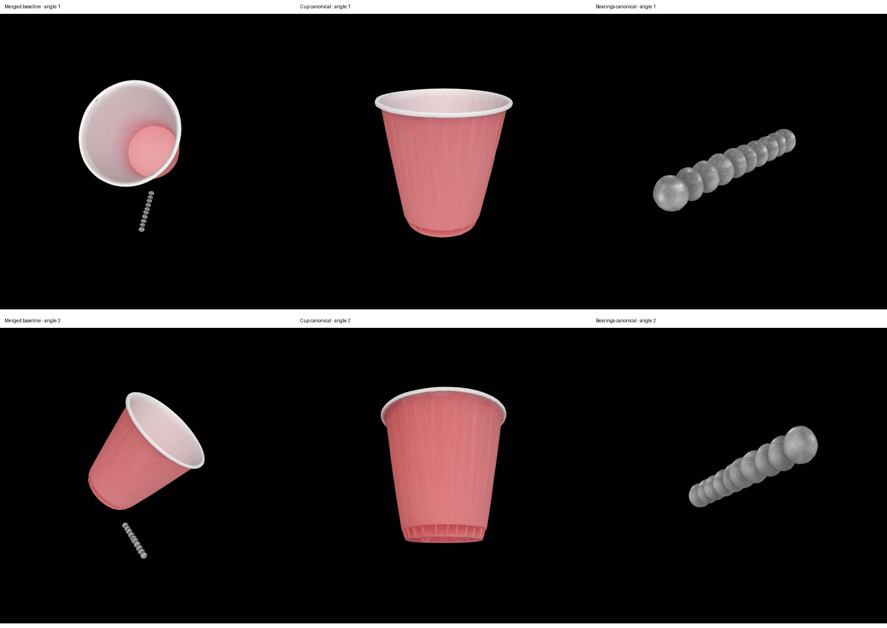

# Introducing MV-SAM3D

MV-SAM3D is a framework for reconstructing 3D objects from multi-view RGB photos and per-object masks. It adds multi-view fusion to SAM 3D Objects and uses depth and camera estimates from Depth Anything 3 (DA3) to place objects in a scene.

This repository is a fork of [devinli123/MV-SAM3D](https://github.com/devinli123/MV-SAM3D). It includes a unified installation script, the `--low_vram` option, and fixes for paths and runtime environments.

## Wiki Guide

1. **Project introduction** — this page
2. [Installation and Setup](Installation)
3. [Data Preparation](Data-Preparation)
4. [Running: Reconstructing Multiple Objects from Issue #2](Running)
5. [Model Architecture](Model-Architecture)

## This Example: Red Cup + Ball Bearings

This example uses the photos from [issue #2](https://github.com/wyim-pgl/MV-SAM3D/issues/2).

- `red_cup`: one red cup
- `ball_bearings`: all the ball bearings in the row, treated as one group
- Goal: per-object masks → DA3 → per-object 3D generation → merge both objects into one scene

**Multi-view** means observing a scene from several viewpoints; **multi-object** means reconstructing multiple objects within the scene separately. This example uses both. To reconstruct each bearing as an independent object, each one needs its own mask folder and a consistent ID across views.

> **Current status:** SAM 3 model access is pending. The validated results use **SAM 1 with manually specified boxes on the original three views**. The newly requested SAM 3 run uses **only original views 0 and 2, with seven visible bearings**, and **has not run**. The results below are not an automatic SAM 3 or grounding result, nor a validated two-view result.

> The issue #2 photos were successfully processed on an RTX 4090 (24 GB). After generating masks using SAM 1 with manually specified boxes, DA3 and the default multi-object inference produced and rendered a **GLB containing two meshes: the cup and the bearing group**. The out-of-memory issue in the existing GPU pose optimization was also fixed. With that fix, **pose optimization succeeded for both the cup and the bearings**, and the optimized GLB was verified to contain two meshes. See [results and limitations](Running).

The left panel shows the merged scene; the center and right panels show the respective canonical models. Each object panel is scaled independently to fit the frame, so sizes should not be compared across panels.

## Features and Limitations

- Single-object and multi-object reconstruction
- Attention-entropy-based weighted multi-view fusion
- Mesh (GLB) and Gaussian splat (PLY) output
- DA3 scene merging and optional pose optimization
- Mask generation is a separate preprocessing step. `--mask_prompt` is a **mask folder name**, not a sentence passed to a segmentation model.
- Small metallic bearings, reflective surfaces, occlusion, and too few views can reduce reconstruction quality.
- Automatic recovery of real-world dimensions and measurement accuracy are not guaranteed.

## References

- [Paper: MV-SAM3D](https://arxiv.org/abs/2603.11633)
- [Project README](https://github.com/wyim-pgl/MV-SAM3D/blob/main/README.md)
- [SAM 3D Objects](https://github.com/facebookresearch/sam-3d-objects)
- [Depth Anything 3](https://github.com/ByteDance-Seed/Depth-Anything-3)

Baseline run: [`f608536`](https://github.com/wyim-pgl/MV-SAM3D/tree/f6085368ff52a8dbf7267e3acceef7fb19a31047). Successful pose optimization used this code with the KNN memory fix in `pose_optimization.py`. The fixes, tests, and Wiki are kept in local commits and have not yet been pushed to GitHub. [How the validated result was produced](Running#7-how-the-validated-result-was-produced) documents the commands and verification steps.
