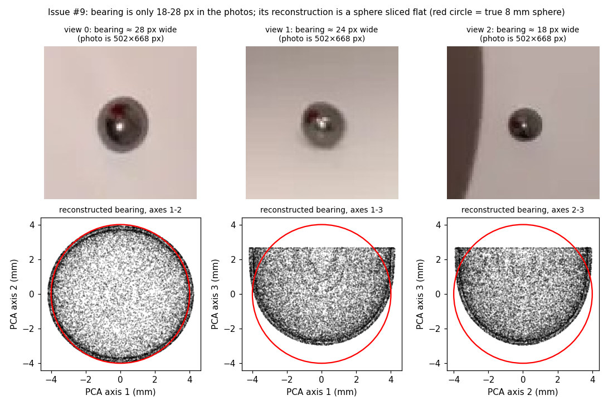

# Real-World Size from a Spherical Reference

[Home](Home) · [Reference-volume calibration](Volume-Calibration) · [Grounding](Grounding)

MV-SAM3D outputs are **not in physical units**. DA3 depth and SAM 3D object scales are relative. To get millimetres, a reference of known size must be photographed in the same scene and the scale must be derived from it. This page records why the 8 mm bearing reference in [issue #9](https://github.com/wyim-pgl/MV-SAM3D/issues/9) gave wrong sizes and shapes, what was measured, and the procedure that gives a defensible size.

## Summary

| Problem | Measured cause | Consequence |
| --- | --- | --- |
| Bearing shape is wrong | The issue #9 photos are only **502 × 668 px**. The bearing covers **18–28 px** (265–629 px area, < 0.2 % of the image). SAM 3D reconstructs it as a sphere **sliced flat** about one third of the way through (PCA extents 1 : 0.94 : 0.67, 264 surface shells, mesh volume only 12 % of its convex hull, sphericity 0.13 where a sphere is 1.0). | The bearing mesh cannot serve as a reference shape or volume. |
| Bearing size is wrong after `--pose_opt_optimize_scale` | The optimizer fits the mesh to DA3 points selected by mask back-projection with a **10 % relative depth tolerance** (≈ 0.05 DA3 units at this distance, twice the bearing diameter). For the bearing, the selected target cloud (1,133 points, reproduced exactly from the run log's 1,131) spans **0.048 DA3 units**, while the bearing is **0.0226** wide. | Bearing scale grew **0.0238 → 0.0382 (× 1.61)**, cup scale shrank × 0.90. Cup-to-bearing size ratio changed by × 1.8 between the two GLBs. **Fixed 2026-10-05**, see [below](#pose-optimization-fix-2026-10-05). |
| Volume calibration gives a wrong scale | `measure_scene_volumes.py` divides a known volume by the **mesh volume** of the reference. The bearing mesh is fragmented and truncated, so its volume is far below a sphere's. | Linear scale error of roughly × 2 even before pose optimization. Do not use this bearing mesh for volume calibration. |
| Cup shape is distorted | SAM 3D cup has a rim wider than its height (rim/height 1.06), with 13.6 % RMS residual to a fitted frustum. The photos indicate rim/height ≈ 0.85. | Cup dimensions from the mesh are approximate even with a correct scale. |



## Scale measured from the photos instead of from the mesh

A sphere's silhouette gives its size exactly, independent of how badly the sphere is reconstructed. For each view, with equivalent silhouette radius *r* (pixels at DA3 resolution), focal length *f*, and median DA3 depth *z* on the visible front surface:

```text
alpha        = atan(r / f)
R (DA3 unit) = z * sin(alpha) / (1 - sin(alpha))
scale        = known diameter in mm / (2 R)          [mm per DA3 unit]
```

Issue #9 results (DA3 process resolution 378 × 504):

| View | Bearing width (photo px) | Median depth | Bearing diameter (DA3 units) |
| --- | ---: | ---: | ---: |
| 0 (oblique) | 28.3 | 0.4734 | 0.02354 |
| 1 (side) | 23.9 | 0.5635 | 0.02346 |
| 2 (top-down) | 18.4 | 0.6435 | 0.02068 |

Mean 0.02256 DA3 units, coefficient of variation 5.9 % → **354.7 mm per DA3 unit** (340.5 using views 0–1 only; view 2 has the smallest bearing and the lowest SAM 3 score, 0.41).

## Cup size estimated from the photos

The cup was measured directly from DA3 points and silhouettes, multiplied by the scale above. These are estimates with roughly ±10 % uncertainty, not verified measurements.

| Method | Height (mm) | Rim Ø (mm) | Base Ø (mm) |
| --- | ---: | ---: | ---: |
| Side view 1, silhouette widths with depth correction | ≈ 94–98 (front surface, rim lip excluded) | 80–84 (below lip) | 52–54 (10 % above base) |
| Frustum fit to DA3 points, view 1 (best single view) | 98.9 | 81.7 | 59.0 |
| Frustum fit, views 0 / 2 (partial surfaces) | 83.7 / 85.8 | 89.9 / 96.6 | 63.2 / 54.3 |
| SAM 3D cup, original pose, × 354.7 | 102.5 | 108.3 | 59.1 |
| SAM 3D cup, optimized pose, × 354.7 | 92.3 | 97.5 | 53.3 |
| Previous approach: cup ÷ bearing mesh, original GLB | 110.7 | 116.9 | 63.8 |
| Previous approach: cup ÷ bearing mesh, optimized GLB | 62.0 | 65.5 | 35.8 |

The best photo-based estimate is **height ≈ 95–100 mm, rim ≈ 82–90 mm, base ≈ 55–60 mm**. Fusing all three DA3 views into one frustum fit failed (35 % residual), which indicates the three DA3 camera poses disagree by several centimetres; per-view numbers are therefore reported separately. **The physical cup must be measured with a ruler to validate these numbers.**

## Recommended procedure

1. **Photograph at full resolution.** Upload or copy the original camera files (≥ 12 MP). GitHub issue attachments of 502 × 668 px are too small.
2. **Make the reference big in the frame.** The reference should be at least **40–50 px wide** in every photo after downscaling, ideally ≥ 1 % of the image. Use a larger sphere (≥ 20–25 mm, matte if possible) or a flat printed ruler / ArUco / checkerboard placed next to the object at the same distance. An 8 mm polished bearing is too small and too reflective.
3. **Take 8–20 views** around the object, keeping the reference visible.
4. **Scale optimization now skips small objects automatically.** `--pose_opt_optimize_scale` keeps the scale of any object narrower than 32 px in every view fixed (`--pose_opt_min_scale_px`). Before this fix it inflated the bearing by 61 %. Even with the fix, use the reference only for its silhouette (step 5), not its optimized mesh.
5. **Derive the scale from the reference silhouette and DA3 depth**, not from the reconstructed reference mesh or its volume, then multiply object dimensions measured in the DA3 frame. The script below automates this.
6. **Validate** against at least one independently measured dimension (for example, cup height measured with a ruler) before reporting sizes.

## Pose-optimization fix (2026-10-05)

Two changes in `sam3d_objects/pose_align/pose_optimization.py` and `run_inference_weighted.py`:

1. **Size-aware depth tolerance** (`--pose_opt_size_tolerance`, default 0.5). When selecting target points, the depth tolerance is now capped at half of the object's apparent size in each view (equivalent mask diameter × median mask depth / focal length). It used to be 10 % of depth for every object. `none` restores the old behavior. For the bearing the cap is 0.010–0.012 DA3 units instead of about 0.05, and the target drops from 1,133 to 493 points. The cup's cap (0.12–0.16) is above its 10 % tolerance, so its target is unchanged: the same 160,787 points.
2. **Small-object scale guard** (`--pose_opt_min_scale_px`, default 32; 0 disables). If an object's mask is narrower than this many pixels (equivalent-circle diameter) in **every** view, its scale stays fixed and only rotation and translation are optimized. A warning is logged.

Change 1 alone reduced the bearing inflation from × 1.61 to × 1.25. The remaining growth comes from fitting a truncated mesh to a full visible-hemisphere target. A tested alternative rejected points seen outside the mask in any view. It left only 173 points and inflated the bearing × 3.9, so it was not kept.

Issue #9 rerun with the same command (`--run_pose_optimization --pose_opt_optimize_scale`), RTX 4090:

| | Bearing scale | Bearing largest extent (mm, × 354.7) | Cup scale |
| --- | ---: | ---: | ---: |
| Before (original pose) | 0.02379 | 8.4 | 0.3347 |
| Before (optimized) | 0.03821 | 13.5 | 0.3012 |
| Size-aware tolerance only | 0.02966 | ≈ 10.5 | 0.3009 |
| **After both changes (optimized)** | **0.02379** (fixed, 28.3 px < 32) | **8.4** (ratio 1.05) | **0.3010** |

The bearing mesh is still flattened (shortest/longest extent 0.67). Only better photos fix that. As before, automatic grounding rejected the bearing's support plane, so the run exits 1 after writing both merged GLBs. This grounding failure predates the fix.

Tests: `python -m unittest discover -s tests -p test_pose_target_extraction.py -v` (synthetic 8 mm sphere in front of a wall: the old tolerance pulls in wall points, the new one keeps the target within the sphere). The full suite passes: 60 tests, 1 opt-in CUDA test skipped.

## Script

`scripts/sphere_metric_scale.py` implements step 5. *Status: on branch `fix/metric-scale-small-reference` (see issue [#13](https://github.com/wyim-pgl/MV-SAM3D/issues/13) for the pull request).*

```bash
python scripts/sphere_metric_scale.py \
  --da3-output da3_outputs/<scene>/da3_output.npz \
  --reference-masks data/<scene>/<reference_object> \
  --reference-diameter-mm <measured diameter> \
  --apply-to <run>/result_multiobj_merged.glb \
  --scaled-output <run>/result_multiobj_merged_mm.glb \
  --reference-node object_<k>_<reference_object> \
  --output metric_scale.json
```

- Masks must be named like the DA3 image basenames (`0.png`, `1.png`, ...); RGBA alpha or grayscale masks both work.
- Views where the reference is narrower than `--min-diameter-px` (default 32 px at native mask resolution) are excluded; `--allow-small` keeps them with a warning.
- If the per-view scales disagree by more than `--max-cv` (default 0.10), the command fails unless `--allow-inconsistent` is given.
- `--apply-to` writes a copy of the GLB scaled uniformly to millimetres and reports each node's AABB and PCA extents in mm. `--reference-node` compares that node with the known diameter, which exposes an inflated or truncated reference mesh. The input GLB is never overwritten.
- The report sets `physical_measurement_verified: false`.

Issue #9 run (8 mm bearing): with defaults the command **refuses** the data because every view is below 32 px. With `--allow-small --allow-inconsistent` it gives 339.9 / 341.0 / 386.9 mm per unit (mean 354.65, CV 0.059). Scaled nodes:

| GLB | Bearing PCA extents (mm) | Bearing largest ÷ 8 mm | Cup PCA extents (mm) |
| --- | --- | ---: | --- |
| `result_multiobj_merged.glb` | 8.4 × 7.9 × 5.6 | 1.05 | 124.7 × 117.4 × 115.6 |
| `result_multiobj_merged_optimized.glb` | 13.5 × 12.7 × 9.0 | 1.69 | 112.2 × 105.6 × 104.1 |

(PCA extents of the cup are not height/rim values; see the frustum table above.)

Tests: `python -m unittest discover -s tests -p test_sphere_metric_scale.py -v` (7 synthetic-sphere tests: diameter recovery within 3 % at three distances, small-view exclusion, inconsistency refusal, invalid inputs, GLB scaling, output-alias refusal).

## Limits

- The scale is uniform. It cannot correct an object whose own shape or relative scale is wrong in the mesh (the cup rim above).
- DA3 depth on a small, specular sphere is noisy; check the per-view coefficient of variation.
- Mesh volume is not liquid capacity. Capacity needs an interior region and fill level.
- Numbers on this page are computed from the issue #9 photos and outputs; none have been checked against a physical measurement yet.
