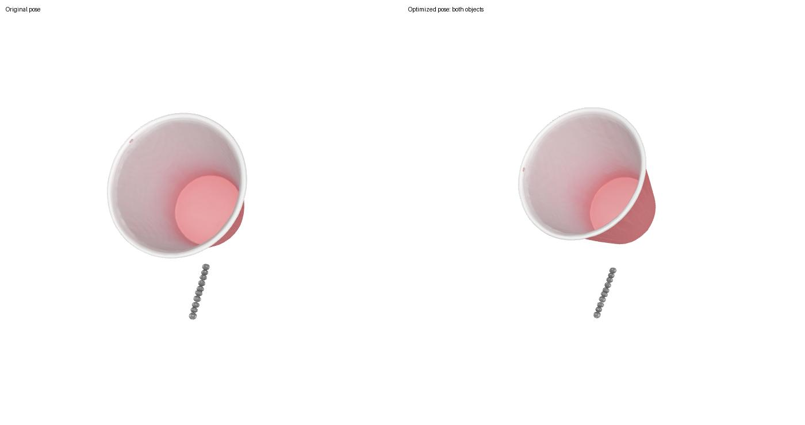

# Running: Multi-Object Reconstruction with Issue #2

[Data Preparation](Data-Preparation) · Next: [Model Architecture](Model-Architecture)

This walkthrough reconstructs the red cup and bearing group in [issue #2](https://github.com/wyim-pgl/MV-SAM3D/issues/2). Prepare the three photographs and **six object-specific RGBA masks** described in [Data Preparation](Data-Preparation).

> **Scope of this page:** the commands and results below document the earlier three-view SAM 1 experiment with manually specified boxes. The newer [SAM 3 text-only two-view walkthrough](SAM3-Two-View-Walkthrough) is also complete and uses only original views `0.png` and `2.png`. Keep the input bundles and results of the two experiments separate.

```text
3 photographs + 3 cup masks + 3 bearing-group masks
                         ↓
              DA3: shared depth and cameras
                         ↓
       Per-object generation and optional pose optimization
                (cup, then bearing group)
                         ↓
                Merge in a shared coordinate frame
```

**Execution verified:** RTX 4090 (24 GB), PyTorch 2.5.1+cu121, base code `f608536`, and the [validated inputs](Data-Preparation). The baseline multi-object run finished in approximately 2 minutes 24 seconds. Its two-mesh GLB was loaded and rendered. Automatic SAM 3 segmentation and measurement accuracy were not verified.


The center and right panels frame each canonical object independently. Their displayed sizes are not comparable. Lighting can change apparent colors; these results do not guarantee bearing-count fidelity, physical dimensions, or accurate scene layout.

## 1. Check the environment and inputs

Activate `mvsam3d` and enter the repository root. If masks were generated in a separate SAM 3 environment, switch back to the reconstruction environment first.

```bash
conda activate mvsam3d
# If installed with micromamba: micromamba activate mvsam3d

test -f checkpoints/hf/pipeline.yaml
find data/issue2_cup_bearings -maxdepth 2 -type f -name '*.png' | sort
```

Check for three photographs and six masks. Run the structural mask checks on the data-preparation page as well.

## 2. Run DA3 for the shared scene

```bash
python scripts/run_da3.py \
  --image_dir ./data/issue2_cup_bearings/images \
  --output_dir ./da3_outputs/issue2_cup_bearings
```

The main output is `da3_outputs/issue2_cup_bearings/da3_output.npz`. Both objects use depth and camera estimates from the same photographs. Do not reuse an NPZ from another scene or a different selection of views.

```bash
test -f da3_outputs/issue2_cup_bearings/da3_output.npz
find da3_outputs/issue2_cup_bearings -type f -name '*.glb'
```

Scene merging also uses DA3's exported scene GLB. Keep visualization enabled; do not add `--no_vis` to this example.

During the validated run, differing image aspect ratios triggered a center-crop warning. The resulting depth array had shape `(3, 504, 294)`, so some image-edge information may be cropped. Do not independently resize images and masks. For more reliable placement, capture a consistent scene with a common aspect ratio.

## 3. Run baseline multi-object reconstruction

```bash
python run_inference_weighted.py \
  --input_path ./data/issue2_cup_bearings \
  --mask_prompt red_cup,ball_bearings \
  --da3_output ./da3_outputs/issue2_cup_bearings/da3_output.npz \
  --merge_da3_glb \
  --low_vram
```

| Argument | Meaning |
|---|---|
| `--input_path` | Scene containing `images/`, `red_cup/`, and `ball_bearings/` |
| `--mask_prompt red_cup,ball_bearings` | Two comma-separated mask directories; selects multi-object mode |
| `--da3_output` | Shared depth and camera estimates |
| `--merge_da3_glb` | Export the reconstructed objects with the DA3 scene |
| `--low_vram` | Move model stages between host and GPU memory as needed |

The code processes objects sequentially and then merges their results. This command neither segments the photographs nor generates all objects in one joint model call.

**Check the logs:** both `red_cup` and `ball_bearings` must complete, followed by `Merging 2 objects`. The current code can merge surviving objects after another object fails, so a final `COMPLETE` message alone does not establish success for both objects.

## 4. Run pose optimization: verified on 24 GB after the memory fix

In the original code (`f608536`), cup pose optimization failed with `CUDA out of memory`. Although `torch.cdist` ran in batches, autograd retained the distance matrices from all batches until backward.

The fix uses the existing PyTorch3D `knn_points` operation to select nearest-point indices, then differentiates only the selected Euclidean distances. Point counts, iteration limits, and the loss definition were not reduced or changed. The initial diagnostic loss calculation no longer retains gradients.

**With the fix applied, the following command completed pose optimization for both the cup and bearings on the RTX 4090.** Reconstruction, optimization, and merging took approximately 2 minutes 35 seconds. The optimized GLB contained both meshes and rendered successfully. A separate loss/backward test with 100,000 target points and 50,000 source points used 18.4 MiB of additional allocated GPU memory; this is not the full pipeline's VRAM usage.

> The fix is included in local commit `fa59d37` and was applied on the validation GPU server. It has not been pushed to GitHub. The old `f608536` checkout alone does not include it. Existing handling of other optimization errors can still return exit code 0; this memory fix did not change that behavior. Check per-object logs and optimized mesh counts.



After reviewing the baseline masks and geometry, run alignment against the DA3 point cloud using the fixed code. This starts a new reconstruction in a timestamped directory; it is not simply a postprocessing command for an existing result.

```bash
python run_inference_weighted.py \
  --input_path ./data/issue2_cup_bearings \
  --mask_prompt red_cup,ball_bearings \
  --da3_output ./da3_outputs/issue2_cup_bearings/da3_output.npz \
  --merge_da3_glb \
  --run_pose_optimization \
  --low_vram
```

Default pose optimization adjusts **rotation and translation**. Add `--pose_opt_optimize_scale` to also optimize relative scale. This aligns size to the DA3 scene; it is not millimeter calibration.

The default erosion kernel of 3 can shrink small bearing masks. If very few valid bearing points remain, first inspect the masks and depth, then consider comparing `--pose_opt_mask_erosion 1`. Pose optimization does not repair incorrect depth or masks.

## 5. Open and inspect the outputs

Multi-object results are written below. `<run>` contains the options and timestamp.

```text
visualization/issue2_cup_bearings/multiobject/<run>/
├── red_cup/
├── ball_bearings/
├── result_multiobj_merged.glb
├── result_multiobj_merged_scene.glb
├── result_multiobj_merged_optimized.glb          # When optimized results exist
└── result_multiobj_merged_scene_optimized.glb    # Optimization plus DA3 merge
```

| File | What to inspect |
|---|---|
| `result_multiobj_merged.glb` | Cup and bearing meshes only |
| `result_multiobj_merged_scene.glb` | Object placement within the DA3 scene |
| `result_multiobj_merged_optimized.glb` | Optimized object placement |
| `result_multiobj_merged_scene_optimized.glb` | Optimized objects within the DA3 scene |

Files are created only when their corresponding steps succeed. An optimized file may contain fewer than both objects; check individual outputs and logs. Multi-object execution may remove the original per-object run directory after copying results to `<run>/<object>/`. Append `> run.log 2>&1` to preserve the complete run log.

The validated baseline `result_multiobj_merged.glb` is **22,876,536 bytes** and contains **two meshes**: 499,516 cup vertices and 72,368 bearing-group vertices. Both have faces and finite coordinates, and the GLB was rendered. These are execution and display checks, not accuracy measurements.

```bash
find visualization/issue2_cup_bearings -type f -name '*.glb' | sort
```

In Blender, use **File → Import → glTF 2.0**. Files containing the DA3 scene can include the original scene surfaces as well. If objects look duplicated, compare with the objects-only `result_multiobj_merged.glb`.

Inspect the following:

- Are both the cup and bearing group present?
- Has table or background geometry become attached to an object?
- Are bearings missing or fused together?
- Are relative placement and size reasonably consistent with the photographs?
- Does pose optimization actually improve the result?

**Ground contact is separate:** pose optimization does not constrain objects to a flat support plane or guarantee contact at Z=0. The displayed optimized result is not a validated grounded result. A final ground-aligned export has not yet been verified.

## 6. Physical scale calibration is a separate step

Issue #2 includes scaling against the cup and bearings as a goal, but it supplies no measured dimensions. This guide does not assume a cup height or bearing diameter.

If a measured reference length is available, measure the corresponding model feature in Blender or another editor, then uniformly scale the **entire merged scene**:

```text
scale factor = measured reference length / corresponding model length
```

Use consistent units and apply the same factor to the full scene to preserve relative object placement. This is postprocessing calibration, not automatic recovery of physical dimensions.

## 7. How the validated result was produced

### 7.1 Check remote GPU access and prerequisites

The validation used the lab's configured SSH alias `gpu`. If that alias is not configured, follow the Lab Wiki's access procedure first.

```bash
ssh gpu
nvidia-smi --query-gpu=name,memory.free,utilization.gpu --format=csv
```

The server had an RTX 4090 with 24 GB and PyTorch 2.5.1+cu121. The existing `mvsam3d` environment and SAM 3D Objects/DA3 checkpoints were reused. No unrelated processes were terminated to free GPU memory.

Run subsequent commands from the **remote MV-SAM3D repository root with the reconstruction environment active**. For a new setup, complete [Installation](Installation) first.

### 7.2 Generate and inspect masks

1. Download the first three issue attachments at their original resolutions.
2. Use the cached `facebook/sam-vit-huge` model (SAM 1); SAM 3 was not installed.
3. Manually specify one cup box and a separate box for each visible bearing in each image.
4. Select the highest-scoring mask candidate for each box.
5. Union the individual bearing masks into `ball_bearings`.
6. Combine original RGB with binary alpha to create six RGBA PNGs, then visually inspect green overlays.

These are **neither default SAM 1 CLI automatic masks nor SAM 3 text-prompted masks**. The [actual script](assets/prepare_issue2_masks.py) contains image-specific coordinates. Its `local_files_only=True` setting requires the model to be present in the local cache.

The simplest reproduction uses the input ZIP linked from [Data Preparation](Data-Preparation). To regenerate the same masks, prepare the original photographs and run the script included in the repository:

```bash
python docs/wiki/assets/prepare_issue2_masks.py
```

The ZIP also includes `sam1_prompt_report.json`, which records the box coordinates and mask areas.

### 7.3 Fix the memory error

The old code computed distances between 5,000 target points and up to 50,000 source points per batch. One float32 matrix of that size requires approximately **954 MiB**. Earlier batches remained in the autograd graph for `loss.backward()`, causing the cup optimization to run out of memory.

Modified file: `sam3d_objects/pose_align/pose_optimization.py`.

```python
# Nearest-point index selection does not require differentiation.
with torch.no_grad():
    nearest = knn_points(
        self.target_points.unsqueeze(0),
        source_aligned.unsqueeze(0),
        K=1,
    ).idx[0, :, 0]

# Differentiate selected Euclidean distances, not squared distances.
cd_loss = torch.linalg.vector_norm(
    self.target_points - source_aligned[nearest], dim=1
).mean()
```

The fix adds `from pytorch3d.ops import knn_points` and wraps the initial loss probe used for learning-rate selection in `torch.no_grad()`. PyTorch3D was already a dependency. Point counts, iteration limits, scale options, and regularization remain unchanged.

Commit `fa59d37` includes the fix. **Only for an older `f608536` checkout**, download the [patch](assets/pose-memory-fix.patch) into the repository root and apply it. Do not reapply it to an already-fixed checkout.

```bash
# Optional step for the old checkout only
git apply --check pose-memory-fix.patch
git apply pose-memory-fix.patch
```

### 7.4 Run the complete validated command sequence

Once masks are ready, generate depth and run reconstruction with pose optimization. Check that each stage succeeds before continuing.

```bash
python scripts/run_da3.py \
  --image_dir ./data/issue2_cup_bearings/images \
  --output_dir ./da3_outputs/issue2_cup_bearings

python run_inference_weighted.py \
  --input_path ./data/issue2_cup_bearings \
  --mask_prompt red_cup,ball_bearings \
  --da3_output ./da3_outputs/issue2_cup_bearings/da3_output.npz \
  --merge_da3_glb \
  --run_pose_optimization \
  --low_vram > issue2-pose.log 2>&1
```

This run used GPU pose optimization. It did not switch to `--pose_opt_device cpu` or enable `--pose_opt_optimize_scale`.

### 7.5 Verify completion beyond the exit code

The completed run was checked for all of the following:

- A `[Pose Optimization] Complete!` message for each object
- `pose_optimization/optimized_params.npz` and optimized GLB files for both objects
- Finite scale, rotation, and translation values
- **Two nonempty meshes** in `result_multiobj_merged_optimized.glb`
- Finite vertex coordinates and nonempty faces
- Successful rendering through an EGL-based offscreen renderer

Run this check immediately after a new run. If multiple runs share the directory, set `run` to the exact output path from the intended log rather than relying on the latest name.

```bash
python - <<'PY'
from pathlib import Path
import numpy as np
import trimesh

root = Path('visualization/issue2_cup_bearings/multiobject')
run = sorted(p for p in root.iterdir() if p.is_dir())[-1]
for obj in ('red_cup', 'ball_bearings'):
    assert (run / obj / 'result_pose_optimized.glb').is_file(), obj
    with np.load(run / obj / 'pose_optimization/optimized_params.npz') as params:
        for key in ('scale', 'rotation', 'translation'):
            assert np.isfinite(params[key]).all(), (obj, key)
path = run / 'result_multiobj_merged_optimized.glb'
scene = trimesh.load(path, force='scene', process=False)
assert len(scene.geometry) == 2, 'Expected cup and bearings'
for mesh in scene.geometry.values():
    assert len(mesh.vertices) > 0 and len(mesh.faces) > 0
    assert np.isfinite(mesh.vertices).all()
print('Verified two optimized meshes:', path)
PY
```

Regression tests were also run:

```bash
POSE_CUDA_STRESS=1 python -m pytest tests -q
```

The result was **11 passed**. New tests compare loss values and pose gradients with the original dense calculation, check finite gradients at coincident points, and enforce a linear bound on saved autograd storage. The memory regression test failed on the old code and passed after the fix. The CUDA stress test's 18.4 MiB is **additional allocation for loss/backward**, not peak VRAM for the complete pipeline.

The final optimized GLB is **22,877,004 bytes**. Its two meshes have **499,524 / 72,370 vertices**. SHA-256:

```text
9f986ec4da76b710c0b870c886b02796415ce6823b2b7f8c11afde4680881c64
```

The local result is `artifacts/issue2-validation/result_multiobj_merged_optimized.glb`. The before/after rendering is `assets/issue2-pose-fixed-preview.jpg`. Large GLBs and complete execution logs are retained as local validation artifacts and are not included in the Git commit.

Code references: [multi-object execution and merging](https://github.com/wyim-pgl/MV-SAM3D/blob/f6085368ff52a8dbf7267e3acceef7fb19a31047/run_inference_weighted.py#L2119-L2370), [pose options](https://github.com/wyim-pgl/MV-SAM3D/blob/f6085368ff52a8dbf7267e3acceef7fb19a31047/run_inference_weighted.py#L3986-L3998).
