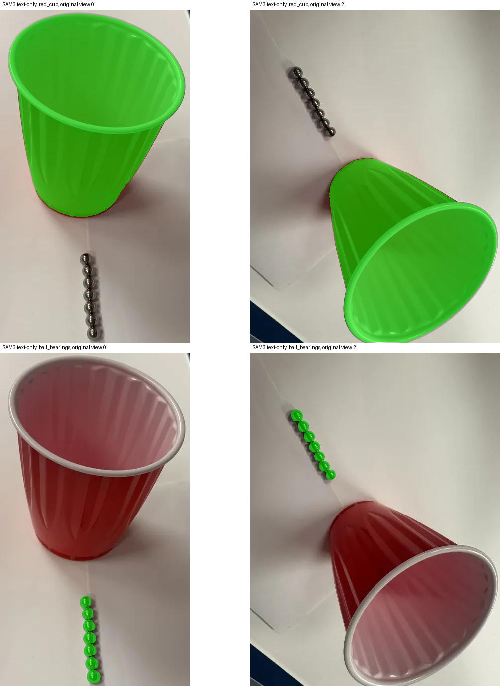
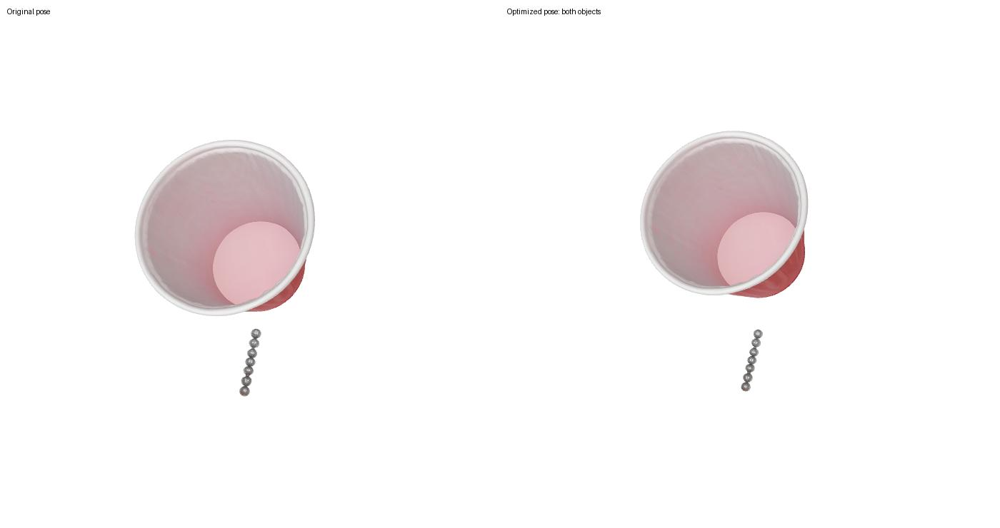
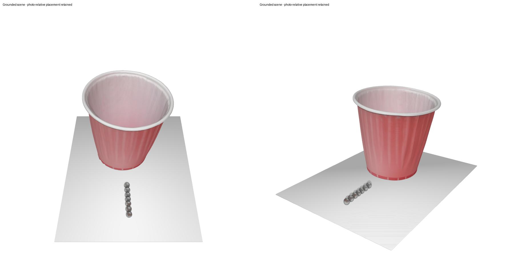

# SAM 3: Two-View, Text-Only Reconstruction

[Home](Home) · [Installation](Installation) · [Data Preparation](Data-Preparation) · [Earlier SAM 1 experiment](Running)

This is the completed SAM 3 workflow for issue #2. It uses **only the original first and third photographs**, named `0.png` and `2.png`. Each contains seven visible bearings. The eight-bearing view `1.png` is excluded.

**No clicks, boxes, or manually drawn masks were used for this run.** The prompts were `red cup` and `metal ball bearing`, with explicit expected counts of 1 and 7. Counts are selection/validation settings, not a guarantee that a language prompt will detect the requested number.

## Verified outcome

- SAM 3 selected one cup and seven distinct bearing masks in **each** image.
- Four RGBA group masks were saved and visually inspected.
- DA3 was rerun for these two views; the earlier three-view depth was not reused.
- Both objects completed reconstruction and GPU pose optimization.
- The optimized GLB contains two nonempty object meshes and was rendered successfully.
- The test suite passed **18 tests**, including the pose-memory stress test and stale-output failure checks.
- An intentional request for eight bearings in a seven-bearing image failed with exit code 1 and skipped DA3.





The bearing masks are combined into one generation target. Two meshes means **one cup mesh and one bearing-group mesh**, not eight independently reconstructed instances. Correct 2D detection counts do not prove exact 3D bearing count, physical dimensions, or ground contact.

## 1. Connect to the GPU server

If using the lab machine, configure the `gpu` SSH alias according to the Lab Wiki first.

```bash
ssh gpu
nvidia-smi --query-gpu=name,memory.free,utilization.gpu --format=csv
```

The validated system uses an RTX 4090 with 24 GB. Reuse the installed `mvsam3d` environment for reconstruction. Do not upgrade its PyTorch installation to install SAM 3.

## 2. Install SAM 3 in a separate environment

Run these commands only when creating a new preprocessing environment. Use the existing environment if it is already installed. The commands assume that the shell is configured for micromamba and that the current directory is the MV-SAM3D repository root.

```bash
micromamba create -y -n sam3-mask python=3.12 pip -c conda-forge
micromamba activate sam3-mask
python -m pip install torch==2.7.1 torchvision==0.22.1 \
  --index-url https://download.pytorch.org/whl/cu126

git clone https://github.com/facebookresearch/sam3.git ../sam3
git -C ../sam3 checkout 660a5e9e1b8b4c02c0ad97229b88a09a6e4ff5b7
python -m pip install -e ../sam3 einops scipy loguru \
  'setuptools<81' pycocotools psutil opencv-python-headless==4.11.0.86
```

The extra packages above were needed by the tested import chain and this repository's image organizer. `setuptools<81` retains `pkg_resources`, which this SAM 3 revision imports. The separate environment used Python 3.12, PyTorch 2.7.1+cu126, torchvision 0.22.1+cu126, and NumPy 1.26.4. The reconstruction environment remained on PyTorch 2.5.1+cu121.

## 3. Download the authorized checkpoint

Request and obtain access at [facebook/sam3](https://huggingface.co/facebook/sam3), then authenticate with the approved account. Never put a token in a script, Wiki page, or commit.

```bash
hf auth login
export SAM3_CHECKPOINT=$(python - <<'PY'
from huggingface_hub import hf_hub_download
print(hf_hub_download(
    'facebook/sam3', 'sam3.pt',
    revision='3c879f39826c281e95690f02c7821c4de09afae7',
))
PY
)
test -f "$SAM3_CHECKPOINT"
python -c "from sam3.model_builder import build_sam3_image_model; print('SAM 3 import OK')"
```

The checkpoint used in validation is 3,450,062,241 bytes. The import check does not prove that segmentation works; the next steps exercise the model itself. An existing authorized checkpoint can be supplied by setting `SAM3_CHECKPOINT` directly to its path.

## 4. Prepare only the seven-bearing images

Use a fresh scene directory. Keep original filenames so image provenance remains clear.

```bash
mkdir -p data/issue2_seven_bearings/images
curl -fL 'https://github.com/user-attachments/assets/3fd8d409-20cd-4fe0-86e1-7bb0a52644cd' \
  -o data/issue2_seven_bearings/images/0.png
curl -fL 'https://github.com/user-attachments/assets/1c969f4f-123e-48af-877c-64e0ed800641' \
  -o data/issue2_seven_bearings/images/2.png
```

The dimensions are 381×668 and 502×668. Do not copy `1.png` into this directory. Do not mix old masks or DA3 outputs with the new selection.

Alternatively, download [the exact validated SAM 3 inputs](assets/issue2-sam3-inputs.zip) into the repository root and extract them:

```bash
sha256sum issue2-sam3-inputs.zip
# 2aa520a0af140843a995a9e436663752236e5ec7f99c888e02aa4ce76c2f21a1
unzip -n issue2-sam3-inputs.zip
```

The archive contains two photographs, four RGBA masks, and the selection report. It contains no model weights. To reproduce segmentation itself rather than reuse its outputs, run the next step.

## 5. Generate counted masks from text

Remain in `sam3-mask` and run from the MV-SAM3D root:

```bash
python preprocessing/build_mvsam3d_dataset.py \
  --input data/issue2_seven_bearings \
  --objects red_cup,ball_bearings \
  --prompts 'red cup,metal ball bearing' \
  --counts 1,7 \
  --confidence_threshold 0.3 \
  --sam3_checkpoint "$SAM3_CHECKPOINT"
```

The positional correspondence is:

| Output directory | Text prompt | Selected instances per view |
|---|---|---|
| `red_cup/` | `red cup` | 1 |
| `ball_bearings/` | `metal ball bearing` | 7 |

`--objects` names the output folders. `--prompts` describes the concepts. `--counts` specifies how many nonempty, distinct mask candidates to select for each object folder. These options must have matching lengths; prompts containing commas are not supported by this CLI format. Omitting `--counts` keeps the default of one selected instance per object.

Selection sorts candidates by score, suppresses duplicates with mask IoU greater than 0.5, and unions the selected masks. It retains disconnected regions; it does not keep only the largest connected component. If more valid candidates exist than requested, only the top requested count is selected. If fewer exist, the view fails rather than padding the result.

At threshold 0.1, this example also produced low-scoring candidates covering much of the bearing row as one object. At threshold 0.3, exactly seven individual bearing candidates remained in each image. The chosen threshold is specific to this tested example and may need adjustment for other scenes.

The output is:

```text
data/issue2_seven_bearings/
├── images/0.png, 2.png
├── red_cup/0.png, 2.png
├── ball_bearings/0.png, 2.png
└── segmentation_report.json
```

All requested views must succeed for a successful scene result. A count mismatch produces a nonzero exit code. Review `segmentation_report.json` and the masks before reconstruction; structural counts alone cannot prove that the correct objects were selected. Use fresh output directories. A failed view removes that view's old output mask, and a new run invalidates the earlier success report before processing. An initialization failure can still leave old image files on disk; never reconstruct from a failed report.

Actual selected scores:

| Original view | Cup count / score | Bearing count / score range |
|---|---|---|
| `0.png` | 1 / 0.9727 | 7 / 0.3594–0.3730 |
| `2.png` | 1 / 0.9648 | 7 / 0.3516–0.3750 |

The [recorded selection report](assets/issue2-sam3-segmentation-report.json) contains the complete scores and mask areas. These scores are model outputs, not calibrated probabilities of correctness.

## 6. Return to the reconstruction environment and run DA3

```bash
micromamba activate mvsam3d
python scripts/run_da3.py \
  --image_dir ./data/issue2_seven_bearings/images \
  --output_dir ./da3_outputs/issue2_seven_bearings
```

Run DA3 separately in `mvsam3d`. The optional preprocessing `--run_da3` flag would otherwise try to run it in the SAM 3 environment, where DA3 was not installed. Different image aspect ratios can cause DA3 center cropping; inspect the depth and scene output.

## 7. Reconstruct and optimize both objects

Use code containing the pose-memory fix and the counted-mask changes:

```bash
python run_inference_weighted.py \
  --input_path ./data/issue2_seven_bearings \
  --mask_prompt red_cup,ball_bearings \
  --da3_output ./da3_outputs/issue2_seven_bearings/da3_output.npz \
  --merge_da3_glb \
  --run_pose_optimization \
  --low_vram > issue2-sam3.log 2>&1
```

The validated reconstruction/optimization run took approximately 2 minutes 14 seconds, excluding installation, download, segmentation, and DA3. It logged successful pose optimization for both objects and merged two meshes.

## 8. Verify the actual outputs

Look under `visualization/issue2_seven_bearings/multiobject/<run>/`. Do not rely on the exit code alone: inference may catch some per-object exceptions and continue.

```bash
python - <<'PY'
from pathlib import Path
import json
import numpy as np
import trimesh

report = json.loads(Path('data/issue2_seven_bearings/segmentation_report.json').read_text())
assert report['success']
for obj in report['steps']['segmentation']:
    assert {v['image'] for v in obj['views']} == {'0.png', '2.png'}
    assert all(v['selected_count'] == obj['expected_count'] for v in obj['views'])

root = Path('visualization/issue2_seven_bearings/multiobject')
run = sorted(p for p in root.iterdir() if p.is_dir())[-1]
for obj in ('red_cup', 'ball_bearings'):
    assert (run / obj / 'result_pose_optimized.glb').is_file()
    with np.load(run / obj / 'pose_optimization/optimized_params.npz') as params:
        assert all(np.isfinite(params[k]).all() for k in ('scale', 'rotation', 'translation'))
scene = trimesh.load(run / 'result_multiobj_merged_optimized.glb', force='scene', process=False)
assert len(scene.geometry) == 2
for mesh in scene.geometry.values():
    assert len(mesh.vertices) and len(mesh.faces) and np.isfinite(mesh.vertices).all()
print('Verified masks and two optimized meshes:', run)
PY
```

If several runs share the directory, use the exact run path from the intended log instead of the latest directory name. Open the resulting GLB in Blender to review shape and layout.

Recorded optimized result:

- File size: **22,333,612 bytes**
- Meshes: **2**
- Cup vertices: **480,438**
- Bearing-group vertices: **77,918**
- SHA-256: `0f8ed227246c5a71bdd7d369503a23a91fc4773920e15c3d0032aa9dab545821`
- Local artifact: `artifacts/issue2-sam3-validation/result_multiobj_merged_optimized.glb`

Full model checkpoints, large GLBs, and raw execution logs are not committed. The Wiki includes input masks, a selection report, and rendered previews.

## 9. Limits and planned work

- No interactive prompts were used, but prompts, threshold, and the intended count were supplied explicitly and results were visually reviewed.
- Seven selected bearing masks do not certify seven accurate, separately measurable 3D bearings.
- Group masks can preserve disconnected regions. Persistent per-instance IDs across views are separate planned work.
- Pose optimization itself does not enforce a flat floor. The separate postprocessing step below verifies floor contact for the cup and bearing-group meshes; it does not certify contact for every individual bearing surface.
- Reference-volume calibration and cup-capacity measurement are not implemented by this workflow. See `docs/TODO.md` in the repository for the planned volume and disconnected-instance tasks.
- These are local, verified changes. No GitHub push has been performed.

## 10. Align the reconstructed objects to the photographed table

A separate postprocessing pass corrected the floating placement without rerunning generation or changing object colors. The original optimized GLB is preserved.



Procedure used for this specific scene:

1. Select visible table samples in original view 0's DA3 point map: vertical range 66–95% of the image, horizontal ranges 8–35% and 65–92%. These regions avoid the cup and bearing row. This is a scene-specific table selection, not a general automatic floor detector.
2. Transform those samples to the same aligned frame as the reconstructed GLB using DA3 camera extrinsics and `hf_alignment`.
3. Fit a table plane with seeded RANSAC and refine its normal with SVD. Rotate the common frame so the table becomes the working Z=0 plane.
4. Apply small rigid rotations around each object's centroid: align the cup's principal axis upright (about 3.73 degrees) and make the bearing row's principal axis horizontal (about 0.64 degrees). Preserve each object's centroid in the table's XY plane.
5. Translate each object only vertically until its lowest vertex reaches Z=0. The cup moved downward; the bearing group moved slightly upward. No scale or vertex-color changes were made.
6. Export an objects-only GLB and a second GLB with a visible support plane. The plane's top is at the same contact height.

The working coordinate system is Z-up. Standard glTF is Y-up, so exports include the coordinate conversion: the floor is at **glTF Y=0**, and Blender's standard importer places it at **Blender Z=0**. Do not apply an additional manual axis conversion after import.

The exported GLBs were reloaded and checked: cup and bearing-group minimum world-space glTF Y are both 0, and the support plane's maximum Y is 0. Object vertex counts, faces, and vertex colors match the original. [Recorded export checks](assets/issue2-grounding-checks.json) include file hashes and bounds.

Local outputs:

```text
artifacts/issue2-sam3-validation/grounded/
├── result_multiobj_grounded.glb             # Two object meshes only
├── result_multiobj_grounded_with_floor.glb  # Two objects plus support plane
├── grounded_preview.jpg
├── grounding_report.json
└── grounding_checks.json
```

Open `result_multiobj_grounded_with_floor.glb` to inspect contact visually. The floor is a visualization aid, not an additional reconstructed physical object or a volume-calibration reference.

**Limits:** this preserves table-plane centroid placement and object geometry, not exact pixel reprojection after changing heights and tilts. Contact was verified for each of the two object meshes as a whole. The generated bearing row contains connected surfaces and uneven radii; rigidly grounding the group does not guarantee that every individual bearing surface touches the plane exactly. No physical units or volume accuracy are established by this alignment.
